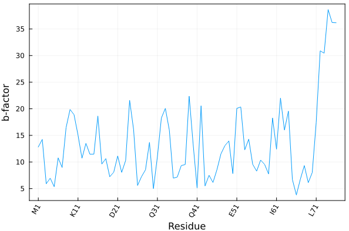

```@meta
CollapsedDocStrings = true
```

# Auxiliary functions 

## Get a protein sequence

To obtain a list of the residue names of the protein with three- and one-letter codes, use
```jldoctest
julia> using PDBTools

julia> pdb = read_pdb(PDBTools.SMALLPDB);

julia> getseq(pdb)
3-element Vector{String}:
 "A"
 "C"
 "D"
```

Use `getseq(atoms,code=2)` to get the sequence as three-letter residue codes, or `code=3` to get 
full natural-aminoacid names, like "Alanine", "Proline", etc:

```jldoctest
julia> using PDBTools

julia> pdb = read_pdb(PDBTools.SMALLPDB);

julia> getseq(pdb; code=2)
3-element Vector{String}:
 "ALA"
 "CYS"
 "ASP"

julia> getseq(pdb; code=3)
3-element Vector{String}:
 "Alanine"
 "Cysteine"
 "Aspartic acid"
```

```@docs
getseq
Sequence
```

!!! note
    If there is some non-standard protein residue in the sequence,
    inform the `getseq` function by adding a selection:
    ```jldoctest
    julia> using PDBTools

    julia> atoms = read_pdb(PDBTools.SMALLPDB);

    julia> for at in atoms
              if resname(at) == "ALA"
                  at.resname = "NEW"
              end
           end

    julia> getseq(atoms, "protein or resname NEW"; code=2)
    3-element Vector{String}:
     "NEW"
     "CYS"
     "ASP"
    ```
    By default the selection will only return the sequence of natural amino acids. 

The `getseq` function can of course be used on an `Atom` list, accepts selections as the
last argument, as well as the reading and writing functions:

```jldoctest
julia> using PDBTools

julia> atoms = read_pdb(PDBTools.SMALLPDB);

julia> getseq(atoms, "residue > 1")
2-element Vector{String}:
 "C"
 "D"
```

## Residue tick labels for plots

The `residue_ticks` function provides a practical way to define tick labels in plots associated to an amino-acid sequence:

```julia
residue_ticks(
    atoms (or) residues (or) residue iterator; 
    first=nothing, last=nothing, stride=1, oneletter=true, serial=false,
)
```

The input structure can be provided as a vector of atoms (type `Vector{<:Atom}`) a residue iterator (obtained by `eachresidue(atoms)`) or a vector of residues (obtained by `collect(eachresidue(atoms))`). 

The function returns a tuple with residue numbers and residue names for the given atoms, to be used as tick labels in plots.

`first` and `last` optional keyword parameters are integers that refer to the residue numbers to be included. 
The `stride` option can be used to skip residues and declutter the tick labels.

If `oneletter` is `false`, three-letter residue codes are returned. Residues with unknown names will be 
named `X` or `XXX`. 

If `serial=false`, the positions of the ticks will be returned as the serial residue index in the structure.
If `serial=true`, the positions of the ticks are returned as their residue numbers. This difference is important
if the residue numbers do not start at `1`, and depending on the indexing of the data to be plotted.  

```@docs
residue_ticks
oneletter
threeletter
```

### Example

Here we illustrate how to plot the average temperature factor of each residue of a crystallographic model as function of the residues.

```julia-repl
julia> using PDBTools, Plots

julia> atoms = wget("1UBQ", "protein");

julia> residue_ticks(atoms; stride=10) # example of output
([1, 11, 21, 31, 41, 51, 61, 71], ["M1", "K11", "D21", "Q31", "Q41", "E51", "I61", "L71"])

julia> plot(
           resnum.(eachresidue(atoms)), # x-axis: residue numbers
           [ mean(beta.(res)) for res in eachresidue(atoms) ], # y-axis: average b-factor per residue
           xlabel="Residue", 
           xticks=residue_ticks(atoms; stride=10), # here we define the x-tick labels
           ylabel="b-factor", 
           xrotation=60,
           label=nothing, framestyle=:box,
      )
```

Produces the following plot:



Alternatively (and sometimes conveniently), the residue ticks can be obtained by providing, 
instead of the `atoms` array, the residue iterator or the residue vector, as:

```julia-repl
julia> residue_ticks(eachresidue(atoms); stride=10)
([1, 11, 21, 31, 41, 51, 61, 71], ["M1", "K11", "D21", "Q31", "Q41", "E51", "I61", "L71"])

julia> residue_ticks(collect(eachresidue(atoms)); stride=10)
([1, 11, 21, 31, 41, 51, 61, 71], ["M1", "K11", "D21", "Q31", "Q41", "E51", "I61", "L71"])
```
## Add hydrogens with OpenBabel

```@docs
add_hydrogens!
```
