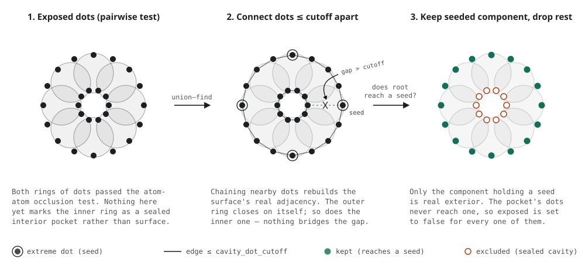

```@meta
CollapsedDocStrings = true
```

# [Solvent Accessible Surface Area (SASA)](@id sasa)

These functions are used to compute the solvent accessible surface area (SASA) of structures or parts of a structure. They provide a very fast implementation of the [Shake-Rupley](https://doi.org/10.1016/0022-2836(73)90011-9) method, using a Fibonacci lattice to construct the grid points.

```@docs
sasa_particles
sasa
```

!!! tip
    The `sasa_particles` function supports periodic boundary conditions if a unit cell is provided. 
    See the how to [read the unitcell](@ref read-unitcell)  for further information.

## Complete structure SASA

A typical run of these functions consists in providing the structure of a protein to the first function, `sasa_particles`, to obtain a `SASA` object, which contains the accessible area per atom:

```@example sasa
using PDBTools
prot = read_pdb(PDBTools.TESTPDB, "protein")
atom_sasa = sasa_particles(prot)
```

The output provides the SASA of the complete structure, but the `atoms_sasa` object created contains the SASA of each atom, from which the accessible area of subsets can be retrieved. 

## SASA of structure subsets

The `atom_sasa` object created above can be used to extract the total accessible area or the accessible area of any sub-surface. The `sasa` function provides an interface for those extractions:

```@example sasa
sasa(atom_sasa) # total
```
```@example sasa
sasa(atom_sasa, "polar") 
```

```@example sasa
sasa(atom_sasa, "backbone")
```

```@example sasa
sasa(atom_sasa, "resname THR and residue < 50") 
```

## Visualization of the surface

In some situations, it might be useful to visualize the surface. The dots that form the surface can be obtained by running `sasa_particles` with the `output_dots` option set to `true`. Here, we use fewer dots for better visualization:

```@example sasa
atom_sasa = sasa_particles(prot; n_dots=100, output_dots=true) 
```

Where the `atom_sasa.dots` field contains the dots that are accessible to the surface for each atom. These can be plotted, for example, with:
```@example sasa
using Plots
dots = reduce(vcat, atom_sasa.dots)
scatter(Tuple.(positions(prot)); color=:orange, msw=0, label="") # atom coordinates
scatter!(Tuple.(dots); # surface dots
    color=:blue, ms=1, msw=0, ma=0.5, # marker properties
    label="",
)
```

## SIRAH solvent accessible area

To compute the solvent accessible surface area of SIRAH models, call the `sasa_particles(SIRAH, ...)` method, after [loading the custom protein residues](@ref sirah) and elements of the SIRAH force field:

```@example sirah_sasa
using PDBTools
custom_protein_residues!(SIRAH)
custom_elements!(SIRAH)
sirah_pdb = read_pdb(PDBTools.SIRAHPDB)
```

Now we compute the SASA of the full structure:

```@example sirah_sasa
s_sirah = sasa_particles(SIRAH, sirah_pdb)
```

And the SASA of subsets of the structure can also be obtained:

```@example sirah_sasa
sasa(s_sirah, "sidechain")
```

Here we remove the custom elements and residues, to guarantee proper execution of test codes:

```@example sirah_sasa
remove_custom_protein_residues!()
remove_custom_elements!()
```

## Save and load SASA objects

The SASA object can be stored in a file, something that can be useful for very large systems.

```@docs
save(::AbstractString, ::SASA{R,N,<:AbstractVector{<:Atom}}) where {R<:PDBTools.AtomicRadiiType,N}
load(::Type{SASA}, ::AbstractString)
```

```@example sasa
outfile = tempname() * ".json"
save(outfile, atom_sasa)
atom_sasa_loaded = load(SASA, outfile)
```

The file stores the radii model used in the original calculation, so the loaded object preserves the type parameter:

```@example sasa
typeof(atom_sasa)
```

```@example sasa
typeof(atom_sasa_loaded)
```

The same works for alternative radii models, such as `CreamerUnitedAtomRadii`:

```@example sasa
atom_sasa_creamer = sasa_particles(CreamerUnitedAtomRadii, prot)
save(outfile, atom_sasa_creamer)
atom_sasa_creamer_loaded = load(SASA, outfile)
typeof(atom_sasa_creamer_loaded)
```

## Richards' radii

This parameterization uses
the classic united-atom radii of Richards (1977) and Richmond & Richards (1978), assigning each
heavy atom to a group (tetrahedral/sp3 or trigonal/sp2 carbon, nitrogen, or oxygen, plus thiol or
thioether sulfur) based on the same hybridization classification used for the Creamer radii above.
Hydrogens are ignored, as in the Creamer parameterization:

```@example sasa
atom_sasa_richards = sasa_particles(RichardsUnitedAtomRadii, prot)
sasa(atom_sasa_richards)
```

Two alternative radii sets, both taken from the same source table, are available through the
`radii_set` keyword:

```@example sasa
sasa(sasa_particles(RichardsUnitedAtomRadii, prot; radii_set=:set2)) # Richmond & Richards, 1978 (default)
```

```@example sasa
sasa(sasa_particles(RichardsUnitedAtomRadii, prot; radii_set=:set1)) # Richards, 1977
```

This parameterization reproduces the SASA calculations of
[SurfaceRacer](https://doi.org/10.1002/prot.10250) (Tsodikov,
Record & Sergeev) with a mean absolute error of about 2%.

## Excluding solvent-sealed cavities

### The problem

`sasa_particles` implements the [Shrake-Rupley](https://doi.org/10.1016/0022-2836(73)90011-9)
algorithm: for each atom, a set of points ("dots") is placed on a sphere of radius `atom_radius +
probe_radius`, and a dot counts toward that atom's SASA if it is not covered by any *other single
atom's* inflated sphere. This is a purely local, pairwise test -- the same category of algorithm
used by, e.g., GROMACS's `gmx sasa` (an Eisenhaber et al. 1995 "double cubic lattice" variant of
Shrake-Rupley) and VMD's `measure sasa` -- and it has no notion of whether a dot that survives it
is actually connected to bulk solvent by some continuous path, or whether it instead sits on the
wall of a fully sealed interior cavity. For most protein structures the resulting error is small
(a fraction of a percent to a couple of percent of the total SASA), because most proteins don't
have much topologically sealed interior void space, but it is not zero, and it is exactly the
distinction that some reference programs -- notably
[SurfaceRacer](https://doi.org/10.1002/prot.10250) -- do make (they compute "outside", i.e.
solvent-connected, ASA as topologically distinct from interior-cavity ASA, and exclude the
latter).

### The algorithm

`sasa_particles(...; exclude_cavities=true)` adds exactly that distinction, as a post-processing
step on top of the ordinary Shrake-Rupley result. It works directly on the dots the pairwise test
already found exposed -- not on a separate, discretized voxel/grid representation of the
structure (an earlier version of this feature did use a voxel grid; it was abandoned because it
was both less accurate and far more sensitive to its own tuning parameters, for reasons described
in `cavity_exclusion.jl`'s module docstring):

1. **Collect** every exposed dot of every atom into a single point cloud, in absolute (not
   atom-relative) coordinates.
2. **Connect** two dots, via a [union-find](https://en.wikipedia.org/wiki/Disjoint-set_data_structure)
   structure, whenever they are within `cavity_dot_cutoff` of each other in 3D space. This
   reconstructs the adjacency of the real, continuous molecular surface directly from the already-
   computed dot cloud, rather than from a resampled grid.
3. **Seed** an "exterior" component with the (up to six) dots that individually maximize or
   minimize each Cartesian coordinate (x, y, z) of the whole structure. Each of these is, by
   construction, on the true convex, solvent-exposed exterior of the structure; using six
   independent seeds (rather than a single one) protects against any one of them landing, by
   coincidence, in a small disconnected sliver.
4. **Exclude** any exposed dot whose connected component does not contain one of these seeds --
   i.e., any dot that is only reachable from other exposed dots that are themselves sealed off
   from the true exterior.

The figure below sketches the mechanism on a cross-section of a ring of atoms sealing a small
central cavity. Both the outer surface and the cavity wall carry exposed dots after step 1
("Collect"), indistinguishable from each other; step 2 ("Connect") reconstructs two disconnected
rings, since the gap across the cavity is wider than `cavity_dot_cutoff`; step 3/4 ("Seed" /
"Exclude") keep only the ring reachable from a seed and clear the other:



This only ever *removes* area that the plain pairwise test already counted; it never adds any,
and it has no notion of periodic boundary conditions (`exclude_cavities=true` together with a
non-`nothing` `unitcell` raises an error).

`cavity_dot_cutoff` defaults to twice the estimated nearest-neighbor spacing between dots on the
largest inflated atom sphere present (which depends on `n_dots` and the atom radii/probe radius in
use), but the result is essentially insensitive to the exact multiple over a wide range: on the
3CNA tetramer/dimer benchmark used in this package's tests, cutoffs from 0.6 to 1.3 Å (for the
default `n_dots=512`) all agree to better than 0.01%. This robustness is the main advantage over
the abandoned voxel-grid approach, whose result changed non-monotonically -- and sometimes
drastically -- with its own tuning parameters (see `cavity_exclusion.jl` for the full comparison).

```@example sasa
dimer = read_pdb(PDBTools.DIMERPDB)
sasa(sasa_particles(dimer))                            # default: no cavity exclusion
```
```@example sasa
sasa(sasa_particles(dimer; exclude_cavities=true))     # with cavity exclusion
```

### Scope and limitations

This is a compatibility feature for reproducing SurfaceRacer's specific ASA convention -- not a
general correctness fix, and not a claim that the plain Shrake-Rupley default is "wrong" (it
isn't; it's the same convention used by GROMACS and VMD). It matters here because it is the
convention some transfer-model parameterizations (see the [Record model](@ref record_model)) were
calibrated against. Two caveats worth keeping in mind:

- It is an approximation, not a bit-for-bit reproduction of SurfaceRacer's own exact analytical
  algorithm. On the 3CNA benchmark, it recovers the *difference* between two structures' SASA
  (the quantity that enters an *m*-value) to within about 1% of SurfaceRacer's own number, but
  individual absolute SASA totals can still be off by a percent or two.
- Genuinely small compounds (individual amino acids, short peptides, sugars, and similar) have
  essentially no topologically sealed interior void space to begin with, so `exclude_cavities`
  has little to no effect on them; the correction only becomes appreciable for folded domains and,
  especially, for buried protein-protein or subunit-subunit interfaces.


